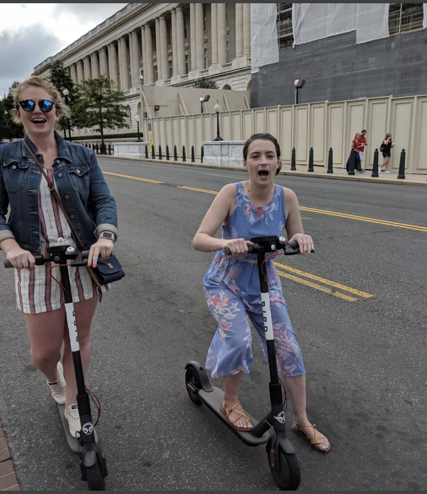

I never really rode bikes, especially not on city streets. I prefer walking or running or watching TV in my pajamas while binge eating oreos. We all have hobbies.
But I was in D.C recently and I rode a Bird, an electric scooter used with a sharing app. And I was cruising and definitely not terrified. 

{:class="img-responsive"}{:height="350px"}

   
If I were terrified (I wasn't), I felt better as soon as I found a bike lane; I felt safe and no longer like I was doing something foolish. 

This made me think about how welcome bikes are in Boston. In Boston, bikes are vehicles so they’re allowed anywhere cars can, and they must follow the same traffic laws. The subject of bicyclists who are cars when its convenient for them and then suddenly pedestrians when it’s time to blow through a red light is a topic for another post (working title: Things I Hate, Part 572). 

But despite their vehicle status, have bikes really always been “welcome”? Boston may say “bicyclists are allowed on the roads,” but that’s not the same thing as “we have built an environment in which anyone who wants to use a bike feels safe and has the resources they need.” And this difference not only harms active bicyclists, but it also prevents people who may consider biking to work from making the switch if they don’t feel safe. So bikes are technically allowed, but they be underutilized and those that are may not feel welcome.

This is the difference between a company saying “women are allowed to work here” and “we have provided and continue to provide the infrastructure and resources that women need to feel safe and valued and to do their jobs to the best of their ability.” It’s the difference between announcing you’re trying to hire females and dedicating resources to it.

In 2017, the City of Boston released a report on a program called Go Boston 2030, which hopes to increase commutes by bike by fourfold- from 2% to 8%1. This report details the 125 Hubway stations deployed since 2008 and 105 miles of bike lanes added. Furthermore, the report brought up a program that I hadn’t heard of: Women’s Cycling Initiative, which distributes free bike safety gear including lights so more people can feel safe while riding, and Roll it Forward, which has distributed 1,132 free bicycles to low-income residents. The City of Boston thinks this may contribute to a 180% increase in bike commuters between 2007 and 2016 2..

So it’s safe to say Boston has started developing resources to help bicyclists and it has helped.

What resources do women need in a company? Well, as a reminder, not all women are the same (pauses to give the crowd time to gasp), but if a company had the following it would benefit a non trivial amount of women:
* Maternity/mothering rooms
    * I’m not sure if people know that even those mothers who go back to work breastfeed; they pump for later or they pump just because it’s painful not to
    * Women who have experienced a stillborn or a terminated pregnancy may still need to pump, so it’s not safe to assume that if someone needed a maternity they would ask; there may be subjects people aren’t comfortable talking about so a maternity room should not wait for a pregnant employee. Furthermore, maternity rooms are an important resource to communicate to potential employees
* More bathroom stalls for women than men if there aren’t enough already
    * Now, if there are no bathroom lines in your office, then there’s no need to gut a conference room and add a toilet, but have you ever noticed there are usually longer lines outside women’s rooms? Even if you have equal stalls in the two bathrooms, there will be a line for the women’s room. According to research at Ghent University3 found that this is because: 
      * Urinals allow for more occupants than the stall only style of women’s rooms
      * Women spend more time per bathroom trip, partially because urinals are easier to use or because of additional menstrual needs (the study didn’t mention that last part but I think it’s obvious)
      * In non-work environments, the women’s room also functions as a family room which increases attendance
      * The study recommends 2 stalls for every urinal or unisex toilets
* Safe spaces where they can communicate any concerns they have
* Anti-discrimination and anti-harassment training for all employees, male and female, so every one can be educated about how to identify and report harassment  

These are some of the resources that some women may feel could change the narrative of the company from “you can work here” to “you are invited here and we want to do whatever we can to ensure you feel safe as anyone else and comfortable staying for as long as you want.” And those are two completely different things.

1. https://www.boston.gov/sites/default/files/go_boston_2030_-_full_report_to_download.pdf  
2. https://www.boston.gov/departments/boston-bikes/bike-data  
3. https://www.simplemost.com/scientists-figured-out-why-womens-restroom-line-longer-mens/  
